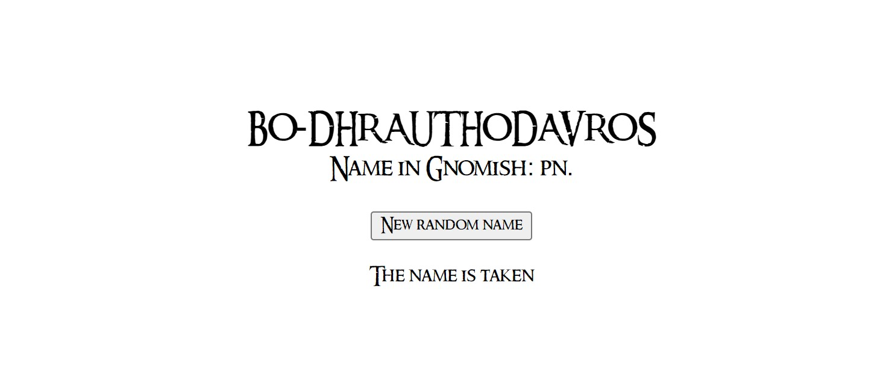
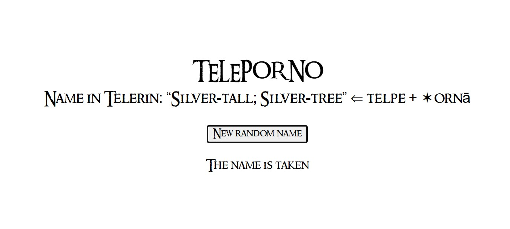

Always wanted to name your project or startup after something from Middle-earth, but found Palantir, Amon Amarth, and Gorgoroth was already taken? Find a name here! You might think that every cool name is already used, but oh boy, you're wrong! I parsed more than 6,000 names, places, and Elvish words from Tolkien, so you can easily find a suitable name.

Some names are pretty funny, and are suitable only for NSFW projects :)

All data is taken from the Appendix of the LotR, from [this Kaggle dataset](https://www.kaggle.com/datasets/paultimothymooney/lord-of-the-rings-data/data), from [BobMoCo website](https://www.glossary.bobmoco.me.uk/index.htm), and from [Eldamo lists](https://eldamo.org/content/languages/index.html).

The font is Ringbearer Medium by [Pete Klassen](https://www.fontspace.com/ringbearer-font-f2246).

GitHub check can be wrong for complex names with unusual characters, so I may want to recheck it by yourself.
 